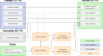

# PowerPC Patcher
This project is a PowerPC ELF patching toolchain. It enables extending a closed-source
PowerPC ELF binary with custom C code.

## Prerequisites
The toolchain was developed on Arch Linux and additionally tested with Debian.
Other Linux distributions work as well, but the required packages need to be
found by the user. Fedora has been successfully tested, but be aware that
it installs a 64bit PowerPC cross compiler that needs to be told to compile 32bit
code by specifying `-m32` in the Makefile `CFLAGS`.

As of April 2019, the required packages for Arch Linux are:

* `core/libelf`
* `core/binutils`
* `extra/cmake`
* `aur/powerpc-linux-gnu-binutils`
* `aur/powerpc-linux-gnu-gcc-stage1`

Required packages on Debian, tested versions in brackets, others might work as well:
* `libelf1` (0.176-1.1, 0.183-1)
* `libelf-dev` (0.176-1.1, 0.183-1)
* `binutils` (2.32.51.20190909-1, 2.35.1-7)
* `cmake` (3.13.4-1, 3.18.4-2)
* `binutils-powerpc-linux-gnu` (2.32.51.20190909-1, 2.35.1-7)
* `gcc-powerpc-linux-gnu` (4:9.2.1-3, 4:10.2.1-1)

Other operating systems may work as well but have not been tested.
The patching utility does not use any operating system dependent functions,
but it relies on Little-Endian byte order like in x86.

## File structure
The file structure in the repository is:
* `elfpatcher` ELF patching utility source code
* `station-code` Root directory for station-side code including the Makefile
    - `include` Header files
    - `lib` Generic support code to interact with the firmware
    - `linker` Linker script.
    - `src` Source code for custom firmware functions like the command server or the call trace implementation.

There is a symbolic link `station-code/tbrc_ram.elf`
pointing to the original firmware binary.
In order to compile custom firmware, ensure that this link is valid.


## Build the patching utility

Before patching an `ELF`, you need to build the `elfpatch` utility:

```
./build.sh
```

This script runs cmake to generate a Makefile,
compiles the utility and creates a symlink `elfpatch` in the repository root directory.


## Building a customized firmware ELF

At first, initial preparation steps are needed:

```
# create symlink to your firmware
cd station-code
ln -s /tmp/original_firmware.elf tbrc_ram.elf

# create address.h file from your firmware
cd include
./genAddressInclude.sh ../tbrc_ram.elf
cd ..
```

Custom firmware can then be build as follows:
```
# build the firmware (within `station-code`)
make

# output will be:
# * tbrc_patched.elf
# * brc.code.1 (gzipped)
```

This runs a simple bash
code generator to perform the syntactic sugar, compiles
all `.c` files in `station-code/lib` and `/station-code/src`, and links
them together into a file called `hooks.elf` using the linker script in `station-code/linker`.
It then runs the `elfpatch` utility to merge the `hooks.elf` 
with the original firmware which it expects to be found at the location pointed
to by the symbolic link `station-code/tbrc_ram.elf` (also see the note in the section *File structure*).
The `elfpatch` utility produces an output file called `tbrc_patched.elf` with
the complete patching output which is then gzipped und saved in the file named `brc.code.1`.

In our case, the base radio accepts an `ELF` file named `brc.code.1` via TFTP.
Different PowerPC-based firmware might need different names and approaches here.

**The original firmware `tbrc_ram.elf` is not included in this repository!**
If you have the original base station and this file, you can use our binary patcher at
your own risk. This should only be done for testing and never in a production environment.

The public release only contains the `execaddr` patch, which allows to execute a
function at a given address with arguments from the serial command line interface.
All other patches are removed, since they expose a lot of internal firmware functionality.


## Creating new interfaces to firmware functions
The file `include/symbols.h` holds all known functions of the firmware that can be called with a normal C call.
To create a new interface to a new reverse-engineered function, it would be possible to just call a function
pointer. But it is more convenient to define an inline function that then calls the function pointer.
The overhead is removed by the compiler because of the inline keyword and the compiler makes
sure that every call follows the parameter definition. The address of every known symbol is defined
in `SYM_ADD_symname`,
which is listed in the autogenerated file `include/address.h`.


## Behind the scenes

The overall patching process is explained in our paper *Dinosaur Resurrection: PowerPC Binary Patching
for Base Station Analysis* published at *Workshop on Binary Analysis Research (BAR) 2021*.

The basic working principle is as follows: `elfpatcher` takes the original firmware,
adds hooks to it as defined in `hooks.txt`, and adds these to a new section in a new firmware.


